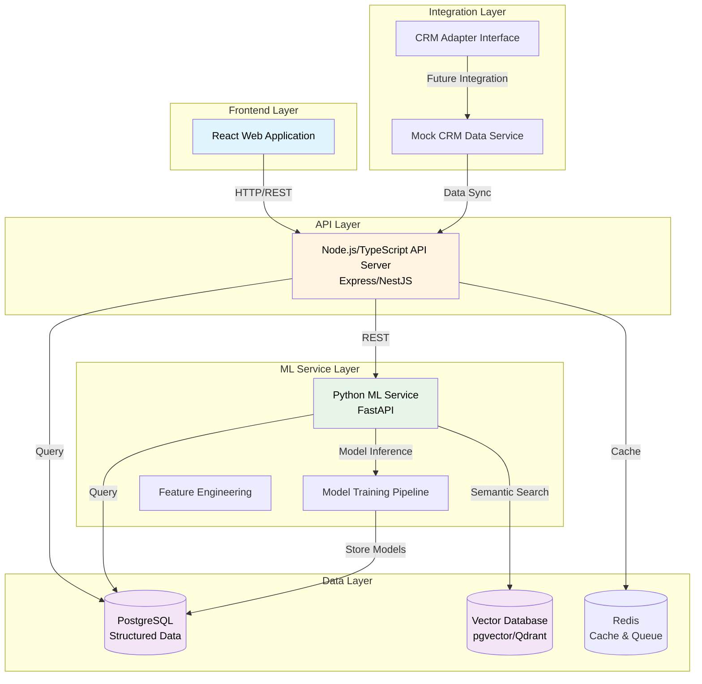
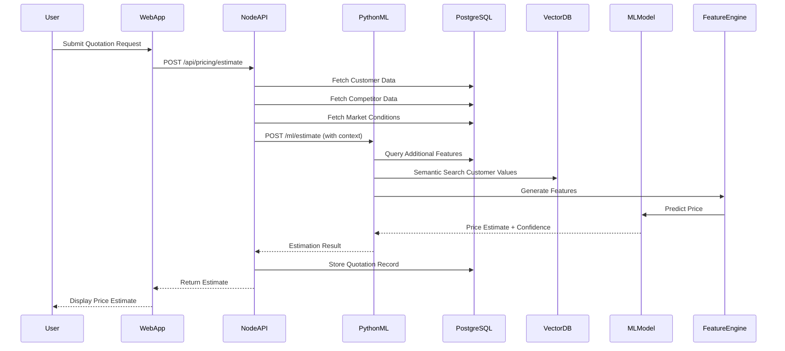

# System Architecture

## Overview

The B2B Pricing Estimator System uses a hybrid microservices architecture that separates concerns between API services, ML processing, and data storage. This design enables scalability, maintainability, and independent deployment of services.

## Architecture Diagram

## Technology Stack

### Backend Services

- **API Server**: Node.js with TypeScript, Express or NestJS framework
- **ML Service**: Python 3.11+ with FastAPI, scikit-learn, XGBoost, pandas
- **Database**: PostgreSQL 15+ with pgvector extension
- **Cache/Queue**: Redis
- **Containerization**: Docker & Docker Compose

### Frontend

- **Framework**: React 18+ with TypeScript
- **UI Library**: Material-UI
- **State Management**: React Query / Zustand
- **Build Tool**: Vite

### ML/Data Science

- **Libraries**: scikit-learn, XGBoost, pandas, numpy, scipy
- **Feature Engineering**: Custom transformers
- **Model Types**: Ensemble (Random Forest + XGBoost + Linear Regression)

## Data Flow

## Service Communication

### API Layer (Node.js)
- Handles HTTP requests from the frontend
- Manages authentication and authorization
- Validates input data
- Coordinates with ML service for price estimation
- Manages database transactions for business data

### ML Service Layer (Python)
- Receives estimation requests from API layer
- Performs feature engineering on input data
- Executes model inference
- Returns price estimates with confidence intervals
- Handles model versioning and A/B testing

### Data Layer
- **PostgreSQL**: Stores structured business data (customers, products, quotations, etc.)
- **Vector Database**: Stores embeddings for semantic search (customer values, product features)
- **Redis**: Caches frequently accessed data and manages job queues

### Integration Layer
- **Mock CRM Service**: Generates synthetic data for development and testing
- **CRM Adapter**: Interface for future integration with real CRM systems

## Security Considerations

- API authentication using JWT tokens
- Rate limiting on API endpoints
- Input validation and sanitization
- Environment-based configuration management
- Database connection pooling
- Secure communication between services (HTTPS in production)

## Scalability

- Stateless API design for horizontal scaling
- ML service can be scaled independently based on inference load
- Database read replicas for query distribution
- Redis clustering for high availability
- Container orchestration ready (Kubernetes compatible)

